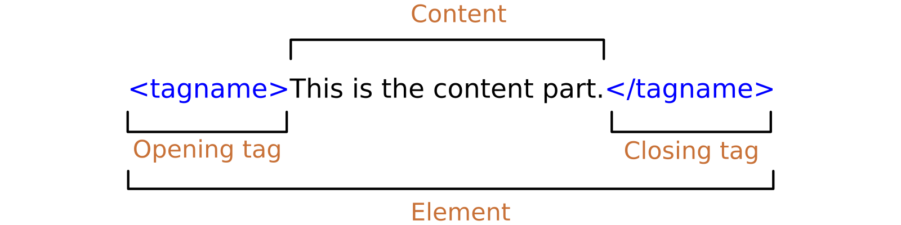

# HTML Elements & Tags

There are two types of HTML elements for display values. They're

## Block level elements

* Always starts with a new line
* Takes up the full width available.
* Has top & Bottom margin

## Inline level elements

* Does not start with a new line
* It takes only as much width as it necessary.

## HTML tags

HTML tags are start with **opening tag** and **some content relevant to that tag** and then **closing tag**

> * HTML Tags means opening and closing tags
> * HTML elements means opening and closing tags and contents in between them

### self closing tag elements

Self closing tag or single tag is HTML tags where there is have only one tag for HTML content. Generally self closing or single Tag is write as  or . Here  is a HTML self closing HTML image tag.

## meta elements

The <meta> tag defines metadata about an HTML document. Metadata is data (information) about the HTML document. <meta> tags always go inside the <head> element, and are typically used to specify character set, page description, keywords, author of the document, and viewport settings.
