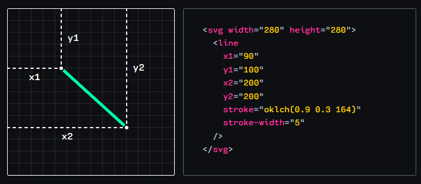
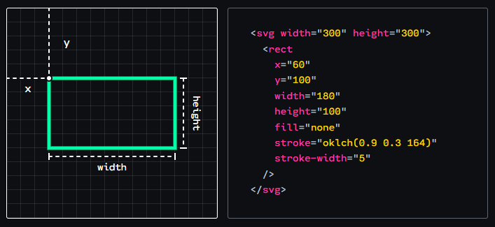
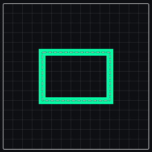
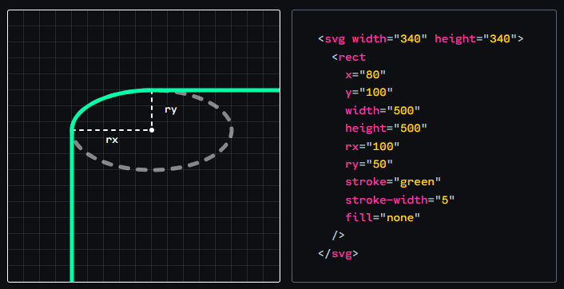
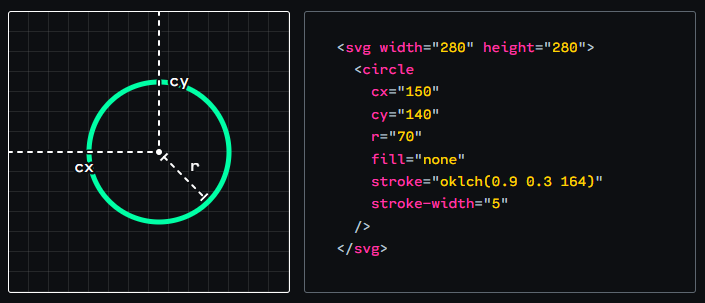
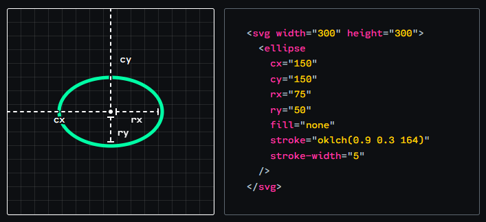
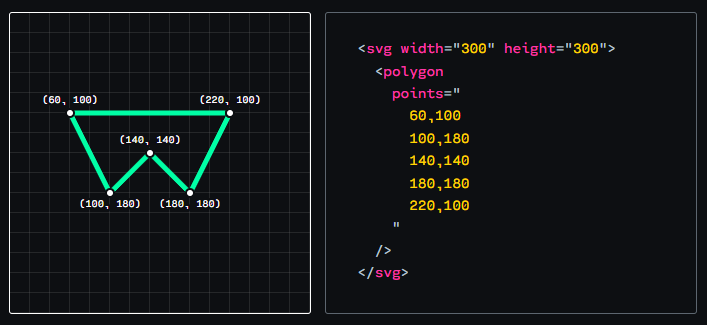

# SVG

## SVG Line

In SVG the most straightforward shape is <line>

## Rectanges

Rectangles are positioned using their top/left corner, specified using x and y. They grow from that size, using width and height.

Stroke is drawn on the center of the path, not on the inside or the outside.

**Round Corner:** ound the corners of our rectangle using the rx and ry properties, similar to border-radius.

## Circle

The size of a circle is dictated by its radius, r. We control the position of the circle by specifying a center point with cx and cy.

## Ellipses

An <ellipse> is just like a <circle>, except we can choose different values for its horizontal and vertical radius. This lets us create ovals.

## Polygon

The <polygon> element lets us create multi-sided shapes. The points attribute takes a list of X/Y points; the browser will draw a line between each point.

## Read More

* [A Friendly Introduction to SVG by Joshw Comeau](https://www.joshwcomeau.com/svg/friendly-introduction-to-svg/)
