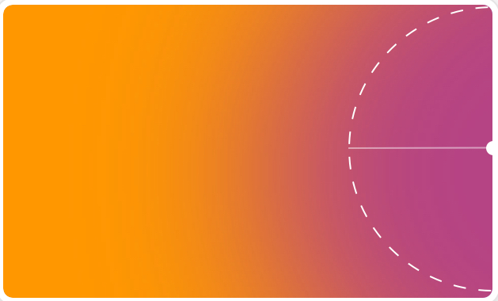
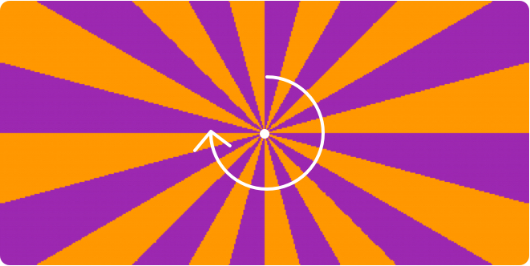
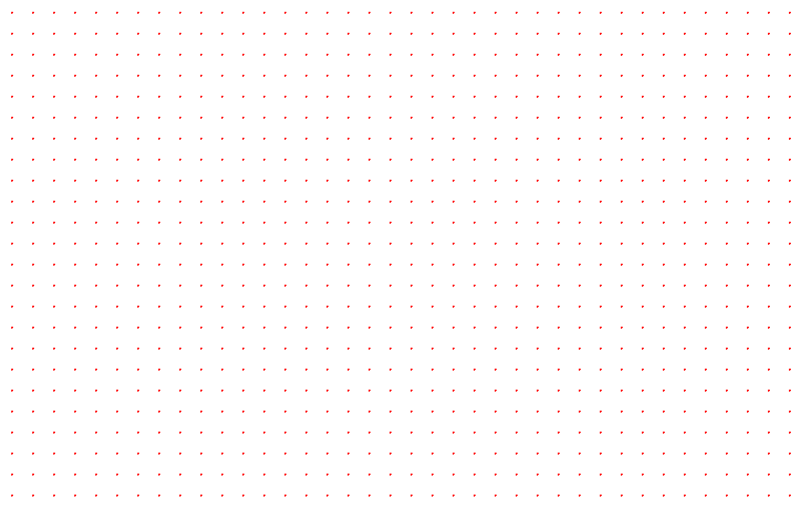
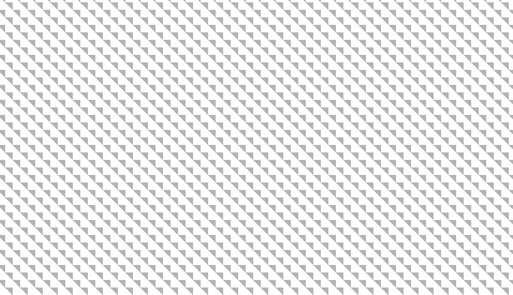
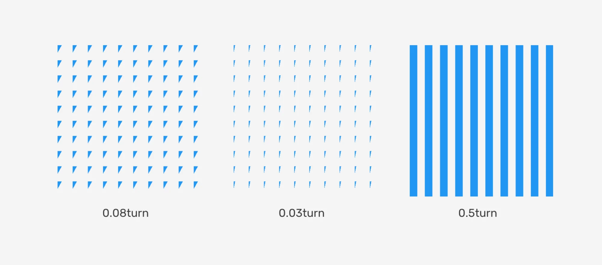
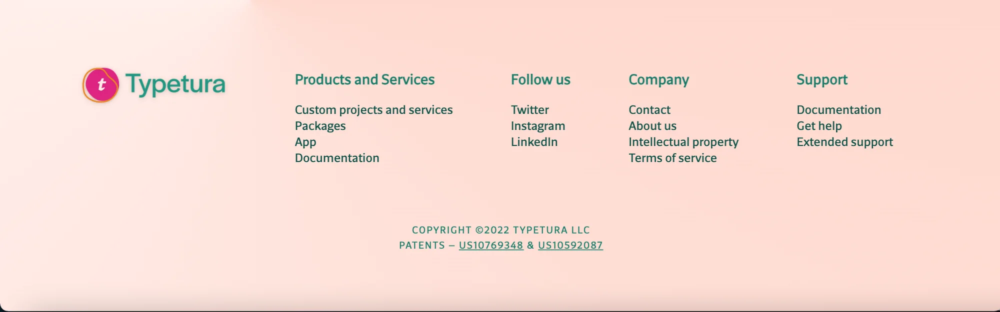
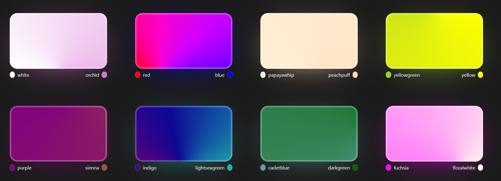
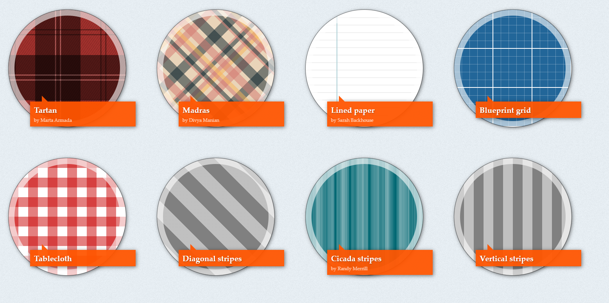

## CSS Gradient Color

* Radial Gradient at center

```css

    { background: radial-gradient(circle, #9c27b0, #ff9800); }

```

* Radial Gradient at top left

```css

    { background: radial-gradient(circle at top left, #9c27b0, #ff9800); }

```


* Radial Gradient at right

```css

    { background: radial-gradient(circle at right, #9c27b0, #ff9800); }

```



* Repeating Conic Gradient

```css

    { background: repeating-conic-gradient( #9c27b0 0 15deg, #ff9800 15deg 30deg ); }

```



* Dotted Pattern By Gradient 

```css

    .dat-pattern {
        height: 100vh;
        width: 100%;
        background-image: radial-gradient(circle at 1px 1px, red 2px, white 0);
        background-size: 2rem 2rem;
    }

```

```html

    <div class="dat-pattern"></div>

```



* Rotating Gradient

```html

    <div class="element"></div>

```

```css

    .element{
        height: 100vh;
        width: 100%;
        background-image: conic-gradient(#fff 90deg, #000 0 136deg, #fff 0 313deg, #000 0);
        /* background-image: conic-gradient(#2296F3 0.13turn, rgba(255,255,255,0) 0); */
        background-size: 2rem 2rem;
        opacity: 0.3;
    }

```




* Different Gradient





* Using Conic gradient for section background

```css

    .footer {
        background: conic-gradient(from 0.25turn at 25% 0%, #FFD9CE, rgba(#FFD9CE, 0) 50%);
    }

```



### Resources

1. [Smashing Magazine A Deep CSS Dive Into Radial And Conic Gradients](https://www.smashingmagazine.com/2022/01/css-radial-conic-gradient/)

2. [A nice css conic gradient library](https://www.conic.style/)



3. [A nice css background Pattern Library](https://projects.verou.me/css3patterns/)



4. [CSS Blending Mode](https://ishadeed.com/article/blending-modes-css/)

5. [Logrocket Advanced effects with CSS background blend modes](https://blog.logrocket.com/advanced-effects-with-css-background-blend-modes-4b750198522a/)